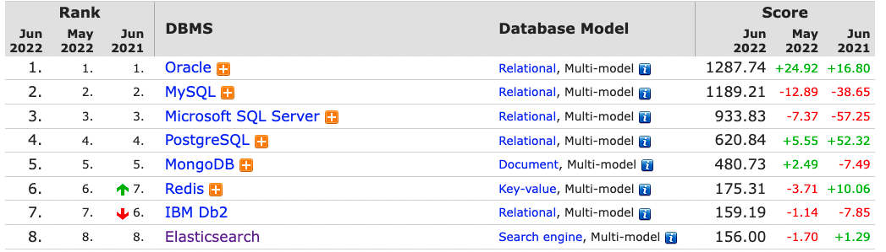

# Elasticsearch(엘라스틱 서치)

## 검색엔진 흐름 🔍
- `아파치 루씬` 역색인(Inverted Index)구조
- 루씬 기반으로 한 `솔라(Solrl)` 검색엔진 시장 장악
- 몇 년 뒤 루씬 기반 `Elastic Search` 검색엔진 분야 지배적 위치

## 엘라스틱 서치 개념 📝
- 아파치 루신 기반 오픈소스 분산 검색 엔진
- 색인 기능이 추가된 NoSQL DBMS
- JSON 기반의 비정형 데이터 및 정형 데이터 검색 지원
- 준실시간으로 데이터를 저장, 검색, 분석 가능
- DB사용률 8위, 검색엔진 1위

## 검색 엔진으로 인기 많은 이유 💐
### 역인덱스
- 흔히 책장 맨 뒤쪽에 단어단위로 나눠져서 어떤 페이지에 나와있는지 적혀있는 것을 말한다.
- 엘라스틱서치에 인덱싱이 이루어지는 경우 분석기 라는 것을 통하여 용어(Term)가 분해되어 역인덱스 사전이 구축된다.
- 관계형 데이터베이스, NoSQL에서는 볼 수 없었던 엄청나게 빠른 속도의 전문 검색을 지원하게 된다.
- SQL의 Like 구문이 전문검색이라고 이야기를 하지만 완벽한 전문 검색은 지원하지 않는다. 하지만 엘라스틱서치 는 분석기를 통한 역인덱싱 으로 이것을 완벽하게 지원한다.

### 분석기
- 엘라스틱서치는 전문 검색을 위하여 3가지로 구성되어있는 분석기 모듈이 존재한다.
- 이렇게 문자를 잘라서 인덱스하는 것을 역인덱스(역색인)이라고 부른다.

#### 토큰 vs 용어
- `토큰` 분석기에서 토크나이저를 통해 필터링 된 문자열이 잘리는데, 이때 잘린 단위
- `용어` 토큰 필터를 거쳐서 최종적으로 정제가 되어 인덱스에 저장되는 토큰들
- 즉, 토큰은 잠시동안 유지되는 상태라는 것이고 실질적으로 검색에 사용되는 것은 용어라고 부르면 된다.

1. **캐릭터 필터**\
입력받은 문자열을 변경하거나, 불필요한 문자를 제거한다.
HTML의 태그같은 것을 처리하거나, 특정 단어를 다른 단어로 변경할 수 있다.
2. **토크나이저**\
문자열을 토큰으로 분리한다.
기본값의 경우에는 공백을 기준으로 토큰화가 이루어진다.
3. **토큰 필터**\
분리된 토큰의 필터 작업을 한다.
소문자, 대문자로 변경하거나 형태소 분석같은 작업이 이루어진다.

### 관계형 데이터베이스 `MySQL` vs `엘라스틱서치`

| MySQL | 엘라스틱서치 |
|-------|--|
|    데이터베이스   | 클러스터 |
|    테이블   | 인덱스 |
|   레코드    | 도큐먼트 |
|   컬럼    | 필드 |
|   스키마    |  매핑 |

### Elasticsearch 장점

- Scale out
  - 샤드를 통해 수평적 확장 가능
- 고가용성
  - 레플리카를 통해 데이터 안정성 보장
- Schema Free
  - Json 문서 형식을 사용
- Restful
  - Rest API 호출 지원
- 역인덱스 지원
  - 책 뒤에 키워드로 정리되어 있는 인덱스 페이지와 같음
  - 텍스트를 파싱하여 토근화를 하고 특정 단어가 얼마나 어디에 쓰였는지 저장
