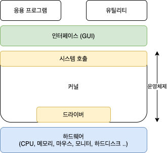

# 운영체제 OS
Operating System

## 정의 📝
- 사용자에게 편리한 인터페이스를 제공하고 컴퓨터 시스템의 자원을 효율적으로 관리하는 소프트웨어
- 일반 컴퓨터나 노트북의 전원을 켜면 **가장 먼저 만나게 되는** 소프트웨어

## 운영체제의 역할 🪄

### 1) 자원 관리
OS는 자원을 요청한 프로그램이 여러개라면 적당한 순서로 **자원을 배분**하고 적절한 시점에 **자원을 회수**한다.

### 2) 자원 보호
비정상적인 작업으로부터 **컴퓨터 자원을 보호** (사용자가 기존의 데이터를 직접 삭제, 혹은 침범)

### 3) 하드웨어 인터페이스 제공 (드라이버)
**하드웨어 인터페이스**가 자동으로 설치되게 함으로써(드라이버)\
하드웨어의 종류에 상관없이 사용할 수 있도록 함(프로그램이)

### 사용자 인터페이스 제공 (CLI, GUI)
**사용자 인터페이스**는 사용자가 운영체제를 편리하게 사용하도록 지원하기 위한 것

## 운영체제 구조

### 커널
- `운영체제 : 자동차 🚗 = 커널 : 엔진 ⚙️`
- 모든 프로그램을 제어하는 시스템 프로그램(시스템 프로세스)
- 프로세스 관리, 메모리 관리, 저장장치 관리와 같은 운영체제의 핵심적인 기능을 모아놓은 것
- 쉽게 말하면 커널은 CPU를 제어하는 S/W
#### 커널의 역할 🪄
- 컴퓨터에 속한 자원들에 대한 접근을 중재한다.
- 유저(어플리케이션, 응용프로그램)은 Shell을 이용하여 Kernel을 통해 하드웨어에 접근하고, 하드웨어의 자원을 사용할 수 있다.
Shell의 I/O요청이 적합한지 판단하고 적합하다면 실행한다. (I/O : 입출력)
- 커널은 여러 프로그램 중 어느것이 프로세스에 할당되어야하는지 결정하는 책임이 있다. `CPU 스케쥴링`

#### 커널이 관리하는 자원
1. 프로세스
2. 메모리
3. 저장장치

#### + RAM(Random - Access - Memory)Permalink
- 램은 프로그램의 명령어와 데이터를 저장하는대에 이용된다.
- Kernel은 각 프로세서가 사용할 수 있는 메모리를 결정하고, 메모리가 부족할 때 수행할 행동을 결정한다.

### 시스템 호출
- 커널이 자신을 보호하기 위해 만든 인터페이스
- 사용자로 하여금 직접적으로 컴퓨터 자원에 접근하지 못하도록 중단 단계를 두는 것
- 사용자가 하드웨어를 사용하고자 한다면 시스템 호출을 통해 커널로부터 허가를 받고 응답을 받아야 한다.

### 디바이스 드라이버
- 하드웨어 벤더에서 제공하는 소프트웨어로 운영체제로 하여금 해당 디바이스를 다룰 수 있도록 기능을 제공하는 소프트웨어
- 디바이스 드라이버를 통해 하드웨어를 다룬다.

### 인터페이스
- `운영체제 : 자동차 🚗 = 인터페이스 : 핸들, 브레이크, 계기판 ⚙️`
- 커널에 사용자의 명령을 전달하고 실행 결과를 사용자에게 알려주는 역할

