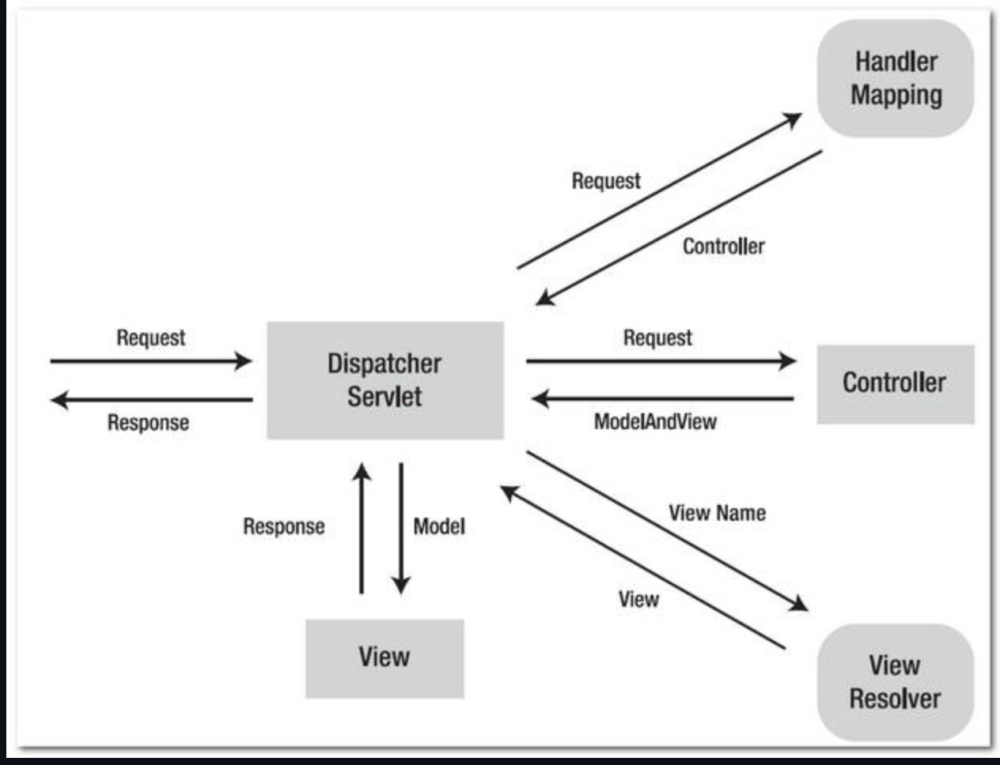
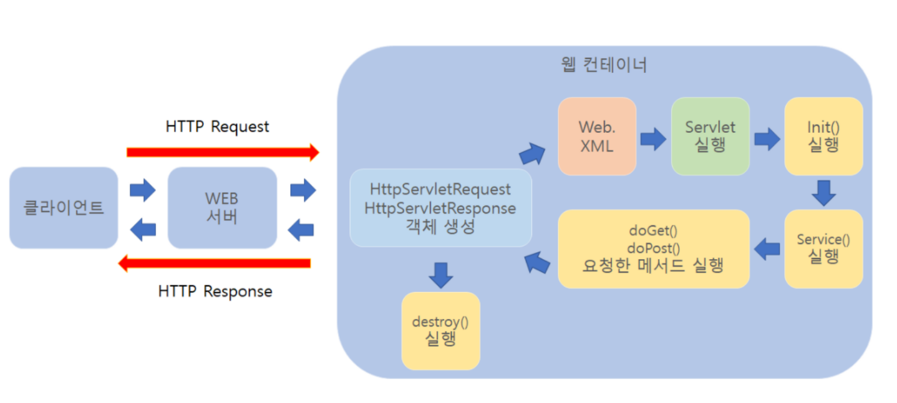
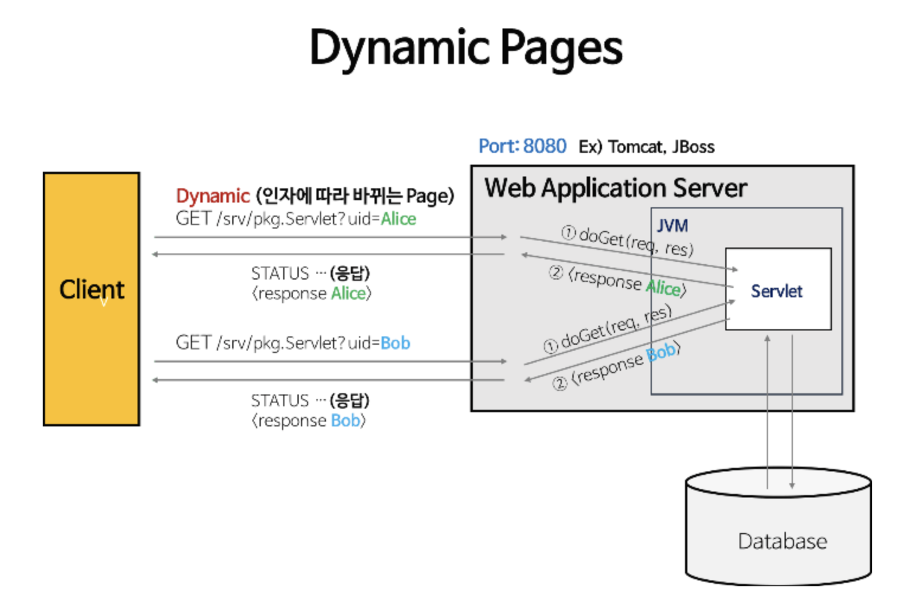
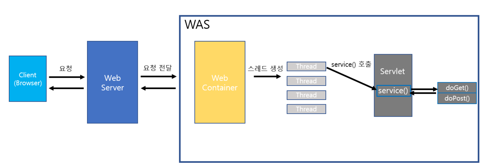

# 스프링의 작동 원리를 알아보자


## MVC 진행 과정

- 클라이언트가 url을 요청하면, 웹 브라우저에서 스프링으로 request가 보내진다.
- `Dispatcher Servlet`이 request를 받으면, `Handler Mapping`을 통해 해당 url을 담당하는 Controller를 탐색 후 찾아낸다.
- 찾아낸 `Controller`로 request를 보내주고, 보내주기 위한 필요한 Model을 구성한다.
- `Model`에서는 페이지 처리에 필요한 정보들을 Database에 접근하여 쿼리문을 통해 가져온다.
- 데이터를 통해 얻은 Model 정보를 Controller에게 response 해주면, Controller는 이를 받아 Model을 완성시켜 Dispatcher Servlet에게 전달해준다.
- Dispatcher Servlet은 `View Resolver`를 통해 request에 해당하는 view 파일을 탐색 후 받아낸다.
- 받아낸 View 페이지 파일에 Model을 보낸 후 클라이언트에게 보낼 페이지를 완성시켜 받아낸다.
- 완성된 View 파일을 클라이언트에 response하여 화면에 출력한다.


구성 요소
-------
### Dispatcher Servlet
모든 request를 처리하는 중심 컨트롤러라고 생각하면 된다. Servlet Container에서 http프로토콜을
통해 들어오는 모든 request에 대해 제일 앞단에서 중앙집중식으로 처리해주는 핵심적인 역할을 한다.
> 기존에는 web.xml에 모두 등록해줘야 했지만, 디스패처 서블릿이 모든 request를 핸들링하면서 작업을 편리하게 할 수 있다.


### Handler Mapping
클라이언트를 request url을 어떤 Controller가 처리해야 할 지 찾아서 `Dispatcher Servlet`에게 전달해주는 역할을 담당한다.
> Controller 상에서 url을 매핑시키기 위해 `@RequestMapping`을 사용하는데, 핸들러가 이를 찾아주는 역할을 한다.

### Controller
실질적인 요청을 처리하는 곳이다. Dispatcher Servlet이 프론트 컨트롤러라면, 이 곳은 백엔드 컨트롤러라고 볼 수 있다.
모델의 처리 결과를 담아 Dispatcher Servlet에게 반환해준다.

### View Resolver
Controller의 처리 결과를 만들 View를 결정해주는 역할을 담당한다.


## Sevlet이란?
> 동적 웹 페이지를 만들 때 사용되는 자바 기반의 웹 애플리케이션 프로그래밍 기술이다. 
> 서블릿은 웹 요청과 응답의 흐름을 간단한 메서드 호출만으로 체계적으로 다룰 수 있게 해준다.

### 주요 특징
- 클라이언트의 Request에 대해 동적으로 작동하는 웹 어플리케이션 컴포넌트
- 기존의 정적 웹 프로그램의 문제점을 보완하여 동적인 여러가지 기능을 제공
- JAVA의 스레드를 이용하여 동작
- MVC 패턴에서 컨트롤러로 이용됨
- 컨테이너에서 실행
- 보안 기능을 적용하기 쉬움

### Servlet의 동작 과정
클라이언트가 웹 서버에 요청하면 웹 서버는 그 요청을 톰캣과 같은 WAS에 위임한다. 
그러면 WAS는 각 요청에 해당하는 서블릿을 실행한다. 그리고 서블릿은 요청에 대한 기능을 수행한 후 결과를 반환하여
클라이언트에 전송한다.  


```
1. 클라이언트 요청
2. HttpServletRequest, HttpServletRequest 객체 생성
3. 어느 서블릿에 대한 요청한 것인지 탐색
4. 해당하는 서블릿에서 service() 메소드 호출
5. doGet() 또는 doPost() 호출
6. 동적 페이지 생성 후 ServletResponse 객체에 응답 전송
7. HttpServletRequest, HttpServletResponse 객체 소멸
```

### Servlet의 생명 주기
> Servlet도 자바 클래스이므로 실행하면 초기화부터 서비스 수행 후 소멸하기까지의 과정을 거친다.
> 이 과정을 서블릿의 생명주기라하며 각 단계마다 호출되어 기능을 수행하는 콜백 메서드를 서블릿의 생명주기 메서드라 한다.


1. 클라이언트의 요청이 들어오면 컨테이너는 해당 서블릿이 메모리에 있는지 확인하고, 없을 경우
    init() 메서드를 호출하여 메모리에 적재한다. init()은 처음 한번만 실행되기 때문에, 서블릿의 스레드에서
    공통적으로 사용해야하는 것이 있다면 오버라이딩하여 구현하면 된다. 실행 중 서블릿이 변경될 경우,
    기존 서블릿을 destroy()하고 init()을 통해 새로운 내용을 다시 메모리에 적재한다.  

2. init()이 호출된 후 클라이언트의 요청에 따라서 service()메소드를 통해 요청에 대한 응답이 doGet()과
    doPost()로 분기된다. 이 떄 서블릿 컨테이너가 클라이언트의 요청이 오면 가장 먼저 처리하는 과정으로
    생성된 HttpServletRequest, HttpServletResponse에 의해 request와 response 객체가 제공된다.  

3. 컨테이너가 서블릿에 종료 요청을 하면 destroy() 메소드가 호출되는데 마찬가지로 한번만 실행되며ㅡ
    종료 시에 처리해야 하는 작업들은 destroy() 메소드를 오버라이딩하여 구현하면 된다.


## 서블릿 컨테이너란?
> 구현되어 있는 서블릿 클래스의 규칙에 맞게 서블릿을 담고 관리해주는 컨테이너다.
> 클라이언트에서 요청을 하면 컨테이너는 HttpServletRequest, HttpServletResponse 두 객체를 생성하여
> POST, GET 여부에 따라 동적인 페이지를 생성하여 응답을 보낸다.


### 웹서버의 통신 지원
서블릿 컨테이너는 서블릿과 웹서버가 손쉽게 통신할 수 있게 해준다. 일반적으로 소켓을 만들고 listen, accept 등을
해야하지만 서블릿 컨테이너는 이러한 기능 API로 제공하여 복잡한 과정을 생략할 수 있게 해준다. 그래서 개발자가 서블릿에 구현해야 할
비즈니스 로직에 대해서만 초점을 두게끔 도와준다.

### 서블릿의 생명주기 관리
서블릿 컨테이너는 서블릿 클래스를 로딩하여 인스턴스화하고, 초기화 메소드를 호출하고, 요청이 들어오면 적절한 서블릿 메소드를
호출한다. 또한 수명이 다 된 서블릿을 적절하게 가비지 콜렉터를 호출하여 필요없는 자원 낭비를 막아준다.

### 멀티쓰레드 지원 및 관리
서블릿 컨테이너는 Request가 올 때마다 새로운 자바 쓰레드를 하나 생성하는데, HTTP 서비스 메소드를 실행하고 나면,
쓰레드는 자동으로 죽게된다. 원래는 쓰레드를 관리해야 하지만 서버가 다중 쓰레드를 생성 및 운영해주니 쓰레드의 안정성에 대해서
걱정하지 않아도 된다.

### 선언적인 보안 관리
서블릿 컨테이너를 사용하면 개발자는 보안에 관련된 내용을 서블릿 또는 자바 클래스에 구현해놓지 않아도 된다.
일반적으로 보안 관리는 XML 배포 서술자에다가 기록하므로, 보안에 대해 수정할 일이 생겨도 자바 소스 코드를 수정하여 다시 컴파일 하지 않아도
보안 관리가 가능하다.
