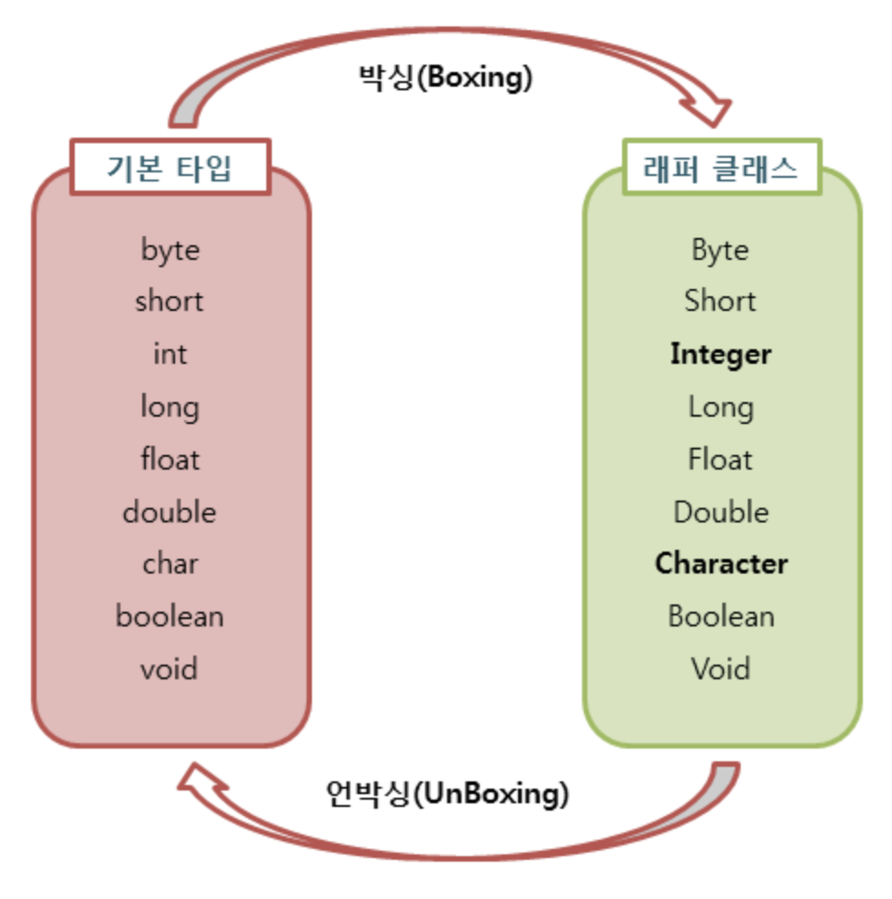

## java 언어의 장단점

- 장점
  - 운영체제에 독립적이다.
    - JVM에서 동작하기 때문에, 특정 운영체제에 종속되지 않는다.
  - 객체지향 언어이다.
    - 객체지향적으로 프로그래밍 하기 위해 여러 언어적 지원을 하고있다. (캡슐화, 상속, 추상화, 다형성 등)
    - 객체지향 패러다임의 특성상 비교적 이해하고 배우기 쉽다.
  - 자동으로 메모리 관리를 해준다.
    - JVM에서 Garbage Collector라고 불리는 데몬 쓰레드에 의해 GC(Garbage Collection)가 일어난다. GC로 인해 별도의 메모리 관리가 필요 없으며 비지니스 로직에 집중할 수 있다.
    - [GC에 더 자세히 알고싶으면 ㄱ ㄱ](https://velog.io/@litien/가비지-컬렉터GC)
  - 오픈소스이다.
    - 정확히 말하면 OpenJDK가 오픈 소스이다. Oracle JDK는 사용 목적에 따라 유료가 될 수 있다.
      - [Oracle JDK의 유료화 이슈](https://okky.kr/articles/490213)
      - 많은 Java 개발자가 존재하고 생태계가 잘 구축되어있다. 덕분에 오픈소스 라이브러리가 풍부하며 잘 활용한다면 짧은 개발 시간 내에 안정적인 애플리케이션을 쉽게 구현할 수 있다.
  - 멀티스레드를 쉽게 구현할 수 있다.
    - 자바는 스레드 생성 및 제어와 관련된 라이브러리 API를 제공하고 있기 때문에 실행되는 운영체제에 상관없이 멀티스레드를 쉽게 구현할 수 있다.
  - 동적 로딩(Dynamic Loading)을 지원한다.
    - 애플리케이션이 실행될 때 모든 객체가 생성되지 않고, 각 객체가 필요한 시점에 클래스를 동적 로딩해서 생성한다. 또한 유지보수 시 해당 클래스만 수정하면 되기 때문에 전체 애플리케이션을 다시 컴파일할 필요가 없다. 따라서 유지보수가 쉽고 빠르다.

- 단점
  - 비교적 속도가 느리다.
    - 자바는 한번의 컴파일링으로 실행 가능한 기계어가 만들어지지 않고 JVM에 의해 기계어로 번역되고 실행하는 과정을 거치기 때문에 C나 C++의 컴파일 단계에서 만들어지는 완전한 기계어보다는 속도가 느리다. 그러나 하드웨어 성능향상과 바이트 코드를 기계어로 변환해주는 JIT 컴파일러 같은 기술 적용으로 JVM의 기능이 향상되어 속도 격차가 많이 줄어들었다.
  - 예외처리가 불편한다.
    - 프로그램 실행 시 발생할 수 있는 예외(Exception)들을 개발자가 직접 선언하여 처리해야 한다. 그렇지 않으면 아예 컴파일이 되지 않는다.
          
    
## Wrapper class
프로그램에 따라 기본 타입의 데이터를 객체로 취급해야 하는 경우가 있다. 예를 들어, 메소드의 인수로 객체 타입만이 요구되면, 기본 타입의 데이터를 그대로 사용할 수는 없다. 이때 기본 타입의 데이터를 먼저 객체로 변환한 후 작업을 수행해야 한다.

#### 자바에서 제공하는 Wrapper class
기본 타입	| 래퍼 클래스
---|---
`byte`|`Byte`
`short`|`Short`
`int`|`Integer`
`long`|`Long`
`float`|`Float`
`double`|`Double`
`char`|`Character`
`boolean`|`Boolean`
이렇게 8개의 기본 타입에 해당하는 데이터를 객체로 포장해주는 클래스를 Wrapper class라고 한다. Wrapper Class는 각각의 타입에 해당하는 데이터를 인수로 전달받아, 해당 값을 가지는 객체로 만들어준다. 이러한 wrapper class는 모두 java.lang패키지에 포함되어 제공된다.

#### Boxing, Unboxing
Wrapper class는 산술 연산을 위해 정의된 클래스가 아니므로, 인스턴스에 저장된 값을 변경할 수 없다. 단지, 값을 참조하기 위해 새로운 인스턴스를 생성하고, 생성된 인스턴스의 값만을 참조 할 수 있다.



위의 그림과 같이 기본 타입의 데이터를 wrapper class의 인스턴스로 변환하는 과정을 Boxing, wrapper class의 인스턴스에 저장된 값을 다시 기본 타입의 데이터로 꺼내는 과정을 UnBoxing이라고 한다.

#### AutoBoxing과 AutoUnBoxing

JDK 1.5부터는 boxing과 unboxing이 필요한 상황에서 자바 컴파일러가 이를 자동으로 처리해 준다. 이렇게 자동화된 boxing과 unboxing을 AutoBoxing과 AutoUnboxing이라고 부른다.

``` java
Integer num = new Integer(17); // 박싱
int n = num.intValue();        // 언박싱
System.out.println(n); // 출력 값: 17


Character ch = 'X'; // Character ch = new Character('X'); : 오토박싱
char c = ch;        // char c = ch.charValue();           : 오토언박싱
System.out.println(c); // 출력 값: X
 ```

 ```
 17
 X
 ```

 오토 박싱을 이용하면 `new` 키워드를 사용하지 않고도 자동으로 `Character` 인스턴스를 생성할 수 있다. 반대로 `charValue()` 메소드를 사용하지 않고도, 오토 언박싱을 이용하여 인스턴스에 저장된 값을 바로 참조할 수 있다.

``` java
public class Wrapper02 {
    public static void main(String[] args) {
        Integer num1 = new Integer(7); // 박싱
        Integer num2 = new Integer(3); // 박싱

        int int1 = num1.intValue();    // 언박싱
        int int2 = num2.intValue();    // 언박싱

        Integer result1 = num1 + num2; // 10 
        Integer result2 = int1 - int2; // 4
        int result3 = num1 * int2;     // 21
    }
}
```

``` java
public class Wrapper03 {
    public static void main(String[] args) {
      Integer num1 = new Integer(10);
      Integer num2 = new Integer(20);
      Integer num3 = new Integer(10);

      System.out.println(num1 < num2);       // true
      System.out.println(num1 == num3);      // false
      System.out.println(num1.equals(num3)); // true
    }
}
```
wrapper class의 비교연산도 AutoUnboxing을 통해 가능해지지만, 인스턴스에 저장된 값의 동등 여부 판단은 비교연산자인 동등 연산자(`==`)를 사용해서는 안 되며, `equals()` 메소드를 사용해야한다.

## OOP의 5대 원칙

"SOLID" !!!
- S: 단일 책임 원칙(SRP, Single Responsibility Principle)
  - 객체는 단 하나의 책임만 가져야 한다.
- O: 개발-폐쇄 원칙 (OCP, Open Closed Principle)
  - 기존의 코드를 변경하지 않으면서 기능을 추가할 수 있도록 설계가 되어야 한다.
- L: 리스코프 치환 원칙(LSP, Liskov Substitution Principle)
  - 일반화 관계에 대한 이야기며, 자식 클래스는 최소한 자신의 부모 클래스에서 가능한 행위는 수행할 수 있어야 한다.
- I: 인터페이스 분리 원칙(ISP, Interface Segregation Principle)
  - 인터페이스를 클라이언트에 특화되도록 분리시키라는 설계 원칙이다.
- D: 의존 역전 원칙(DIP, Dependency Inversion Principle)
  - 의존 관계를 맺을 때 변화하기 쉬운 것 또는 자주 변화하는 것보다는 변화하기 어려운 것, 거의 변화가 없는 것에 의존하라는 것이다.

## 객체지향 프로그래밍과 절차지향 프로그래밍의 차이
- 절차지향 프로그래밍
  - 실행하고자 하는 절차를 정하고 이 절차대로 프로그래밍하는 방법
  - 목적을 당성하기 위한 일의 흐름에 중점을 둔다.
- 객체지향 프로그래밍
  - 실세상의 물체를 객체로 표현하고, 이들 사이의 관계, 상호 작용을 프로그램으로 나타낸다.
  - 객체를 추출하고 객체들의 관계를 결정하고 이들의 상호 작용에 필요한 함수(메서드)와 변수(필드)를 설계 및 구현한다.
  - 객체 지향의 핵심은 연관되어 있는 변수와 메서드를 하나의 그룹으로 묶어서 그룹핑하는 것이다.
  - 사람의 사고와 가장 비슷하게 프로그래밍을 하기 위해서 생성된 기법
  - 하나의 클래스를 바탕으로 서로 다른 상태를 가진 인스턴스를 만들면 서로 다른 행동을 하게 된다. 즉, 하나의 클래스가 여러개 인스턴스가 될 수 있다는 점이 객체 지향이 제공하는 가장 기본적인 재활용성이라고 할 수 있다.

## 객체지향이란
- 객체(Object)
  - 현실세계의 실체 및 개념을 반영하는 상태(Status)와 행위(Behavior)를 정의한 데이터의 집합
- 객체지향(Object-Oriented) 프로그래밍
  - 각자의 역할을 지닌 객체들끼리 서로 메시지를 주고받으며 동작할 수 있도록 프로그래밍 하는 것

### 객체지향의 장점
- 사람의 관점에서 프로그램을 이해하고 파악하기 쉽다.
- 강한 응집력(Strong Cohesion)과 약한 결합력(Weak Coupling)을 가진다.
- 재사용성, 확장성, 융통성이 높다.

이러한 장점 때문에 디버깅과 유지보수가 용이하고 설계와 분석이 비교적 쉽다.

### 객체지향의 단점
- 객체 간의 정보 교환이 모두 메시지 교환을 통해 일어나므로 실행 시스템에 많은 overhead가 발생하게 된다.
  - 처리속도가 상대적으로 느리다.
  - 하지만 하드웨어의 발전으로 이러한 단점은 어느정도 해소되었다.
- 객체가 상태를 갖기 때문에 예상치 못한 부작용이 발생할 수 있다. 변수가 존재하고 이 변수를 통해 객체가 예측할 수 없는 상태를 갖게되어 애플리케이션 내부에서 버그를 발생시킬 수 있다.
  - 이는 함수형 프로그래밍 등장의 패러다임이다.

### 객체지향적 설계원칙 SOLID
- SRP (Single Responsibility Principle) 단일 책임  원칙
  - 클래스는 단 하나의 책임을 가져야 하며 클래스를 변경하는 이유는 단 하나의 이유이어야 한다.
- OCP (Open-Closed Principle) : 개발-폐쇄 원칙
  - 확장에는 열려 있어야 하고 변경에는 닫혀 있어야 한다.
- LSP (Liskov Substitution Principle) : 리스코프 치환 원칙
  - 상위 타입의 객체를 하위 타입의 객체로 치환해도 상위 타입을 사용하는 프로그램은 정상적으로 동작해야 한다.
- ISP (Interface Segregation Principle) : 인터페이스 분리 원칙
  - 인터페이스는 그 인터페이스를 사용하는 클라이언트를 기준으로 분리해야 한다.
- DIP (Dependency Inversion Principle) : 의존 역전 원칙
  - 고수준 모듈은 저수준 모둘의 구현에 의존해서는 안된다.

### 객체지향의 특징
- 추상화
  - 객체에서 공통된 속성이나 기능을 추출하는 것, 중요하지 않은 것(관심 대상이 아닌 것)은 감추거나 무시하고, 중요한 것(관심있는 것)만을 강조하여 추출하는 것. 
  관점에 따라 추상화의 결과가 달라질 수 있다. 주요 관심사에만 집중함으로써, 프로그램의 복잡도를 관리할 수 있다.
- 캡슐화
  - 관심있는 데이터와 기능을 모아놓고 패킹한 것이다. 객체지향에서는 이를 클래스로 정의하고 외부에서 외부에서 마음대로 접근할 수 없게하였다. 
  과거 절차지향 프로그래밍에서는 소스코드가 거대해질수록 데이터가 어디서 어떻게 변화하는지 파악하기 어려웠고 유지보수가 힘들어지는 문제가 발생하였다. 객체지향 프로그래밍에서는 캡슐화를 통해 이런 폐단을 해결하였다. 
  이렇게 내부의 데이터나 함수를 외부에서 참조하지 못하도록 차단하는 개념을 정보 은닉화(Information Hiding)라고 하며 이것이 바로 캡슐화라는 개념이다.
- 다형성
  - 같은 코드라 하더라도 상황에 따라 다른 방식으로 동작하는 성질. Java에서 다형성을 구현할 수 있는 대표적으로 Overriding과 Overloading이 있다.
  - Overriding
    - 임의의 클래스가 다른 클래스를 상속 받거나 인터페이스를 구현했을 때, 상위 클래스 또는 인터페이스에 정의되어 있는 메소드를 재정의 하여 사용하는 것이다. 메소드 호출 시 재정의되어 있지 않다면 상위 클래스의 메소드가 호출된다. (인터페이스는 오버라이딩이 강제된다.)
  - Overloading
    - 메소드에 주어진 인자(parameter)에 따라 동작을 다르게 구현할 수 있다. 코드의 중복이 줄어들고, 가독성이 늘어난다. 반환 형(return type)은 관계가 없지만, 인자의 개수, 인자의 타입에 따라 다르게 구현할 수 있다.
- 상속
  - 부모의 형질을 이어받는다는 의미로, 부모 클래스의 속성과 메소드를 그대로 활용할 수 있다. 여기에 더해 새로운 속성과 메소드를 추가할 수 있으며 같은 메소드라 하더라도 오버라이딩(Overriding)을 통하여 재정의하여 다르게 동작하게끔 할 수 있다. 손쉽게 클래스를 재활용할 수 있으며, 부모가 같은 클래스들을 동시에 처리하기 용이하다.
- 클래스
  - 객체를 만들기 위해 상태(field)와 행위(method)를 정의한 툴
- 메시지
  - 객체지향적으로 구현된 프로그램은 객체들끼리의 메시지를 주고받고 상호작용하며 동작한다. 코드적으로는 임의의 객체에게 인자(parameter)를 전달하여 메소드를 호출하며 반환값(return value)을 받아 처리를 한다.