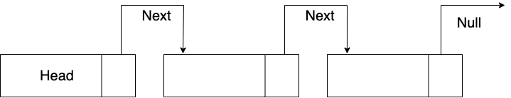
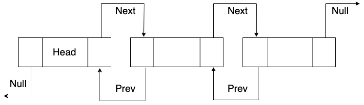
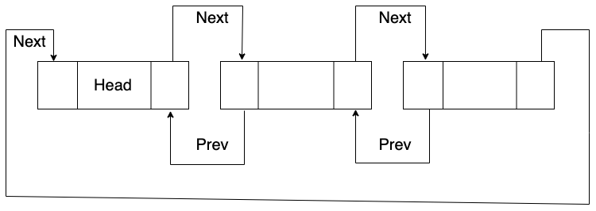
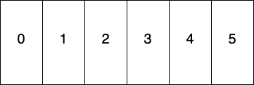
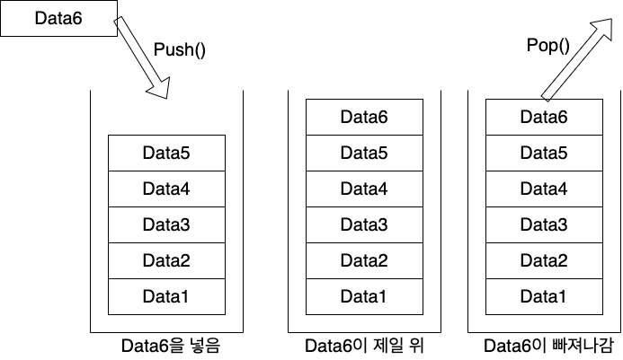
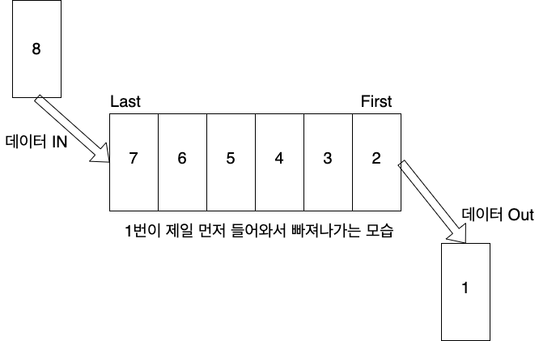
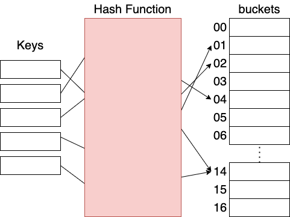
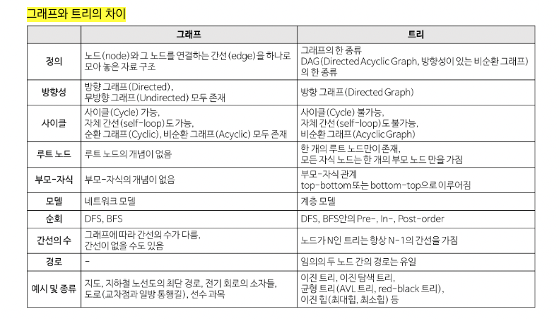
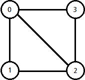
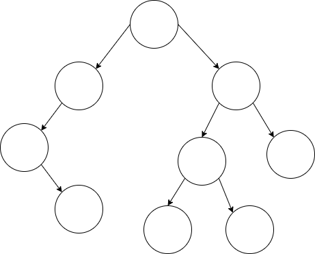

# **CS 스터디 1주차 - 자료 구조**

## 1. 자료 구조의 두 가지 유형
- 데이터를 한 줄로 나열할 수 있는 선형 자료 구조
- 데이터를 한 줄로 나열할 수 없는 비선형 자료구조

## 2. 선형 자료 구조
### 연결 리스트 (Linked List)
- 연결리스트는 데이터의 일부를 포인터로 연결한 자료구조다.
- 서로 연결되어 있는 것이 특징
- 데이터 추가/삭제 - O(1) -> 직접적으로 접근할 수 있기 때문
- 탐색 - O(n) -> 모든 것을 다 훑어봐야하기 때문
#### 싱글 연결 리스트 - Next 포인터만 존재

#### 이중 연결 리스트 - Next, Prev 포인터 존재

#### 원형 이중 연결 리스트 - 이중 연결 리스트와 동일하나, 마지막 노드의 Next 포인터가 헤더의 노드를 가리킴

### 배열 (Array)
- 데이터를 순차적으로 저장하는 구조를 가지고 있으며, 데이터의 순서는 Index라는 것으로 확인을 할 수 있다.
- Index는 0부터 시작
- 배열은 순서를 보장해줘야만 하는 형태의 데이터를 저장할 때 사용하면 좋은 자료구조
- 데이터 단순 접근 - O(1) -> Index 로 접근할 수 있기 때문
- 데이터 추가/삭제 - O(n) -> 접근하기 전까지는 값을 알 수 없기 때문에

  
  
### 스택 (Stack)
- LIFO(Last In First Out) -> 나중에 넣은 원소가 가장 먼저 나오는 구조
- ex) 웹 브라우저 방문기록에서 많이 사용 (뒤로가기 기능) -> 제일 최근에 방문했던 페이지로 넘어가기
- 주로 배열로 구현
- 데이터 탐색 - O(n)
- 데이터 추가/삭제 - O(1)

  

### 큐 (Queue)
- FIFO(First In First Out) -> 먼저 넣은 원소가 먼저 나오는 구조
- ex) 네트워크 접속 대기열 구현에 자주 사용
- 주로 배열로 구현
- 데이터 탐색 - O(n)
- 데이터 추가/삭제 - O(1)

  

### 해시 테이블 (Hash Table)
- Key와 Value로 데이터를 저장하는 자료구조로, 제일 빠르게 데이터를 검색할 수 있는 자료구조
- Key가 해시함수를 사용하여 고유한 배열의 인덱스를 생성해 데이터를 저장
- ex) 자바스크립트에서의 오브젝트, 파이썬에서의 사전 (언어상에서 지원)
- 데이터 접근/추가/생성 - _**일반적으로**_ O(1)
- **_!주의!_** 인덱스가 중복이 될 경우, 일반적으로는 버켓에 데이터가 추가로 입력이 되기 때문에 O(n)의 시간복잡도를 가질 수 있지만, 일반적으로는 O(1)

  

## 3. 비선형 자료 구조

  

### 그래프 (Graph)
- 그래프는 정점과 간선으로 이루어진 자료구조로 순환이 되는 것이 핵심인 자료구조
- 구현 방법 : 인접행렬(Adjacency Materix)와 인접리스트(Adjacency List)방식

- 정점(vertice) : 노드(node)라고도 하며 정점에는 데이터가 저장됩니다. (0, 1, 2, 3)
- 간선(edge): 링크(arcs)라고도 하며 노드간의 관계를 나타냅니다.
- 인접 정점(adjacent vertex) : 간선에 의해 연결된 정점으로 위에서 (정점0과 정점1은 인접 정점)
- 단순 경로(simple-path): 경로 중 반복되는 정점이 없는것, 같은 간선을 자나가지 않는 경로
- 차수(degree): 무방향 그래프에서 하나의 정점에 인접한 정점의 수 (정점 0의 차수는 3)
- 진출 차수(out-degree) : 방향그래프에서 사용되는 용어로 한 노드에서 외부로 향하는 간선의 수를 뜻합니다.
- 진입차수(in-degree) : 방향그래프에서 사용되는 용어로 외부 노드에서 들어오는 간선의 수를 뜻합니다.
 

### 트리 (Tree)
- 계층적인 자료를 표현하는 데 이용하는 자료구조
- ex) 컴퓨터의 directory
- 이진 트리 : 모든 노드가 최대 2개의 서브 트리를 가지고 있는 트리
- 이진 탐색 트리(Binary Search Tree, BST) : 이진 트리에 조건이 더해짐(왼쪽 자식 노드 < 부모 노드 < 오른쪽 자식 노드)
  이진 탐색 트리의 데이터 값은 유일해야 함
- 트리 순회 : 트리의 모든 노드들을 한 번씩 방문하는 것 (전위 A->B->C, 중위 B->A->C, 후위 B->C->A)

- 루트 노드(root node) : 부모가 없는 최상위 노드
- 단말 노드(leaf node) : 자식이 없는 노드
- 크기(size) : 트리에 포함된 모든 노드의 개수
- 깊이(depth) : 루트 노드로부터의 거리
- 높이(height) : 깊이 중 최댓값
- 차수 (degree) : 각 노드의 간선 개수